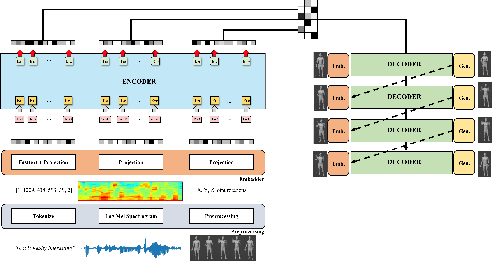

# Co-speech_gesture_generation
Co-speech Gesutre Generation for ICASSP 2023

# Dependency
> numpy  
> scipy  
> torch  
> lmdb  
> pyarrow  
> torchaudio  
> fasttext  
> librosa  

# model structure

# Results

https://www.youtube.com/watch?v=I3iDZCkI_R8&t=2s
